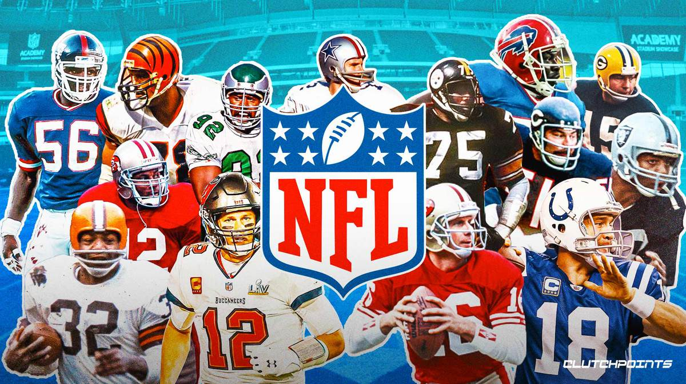
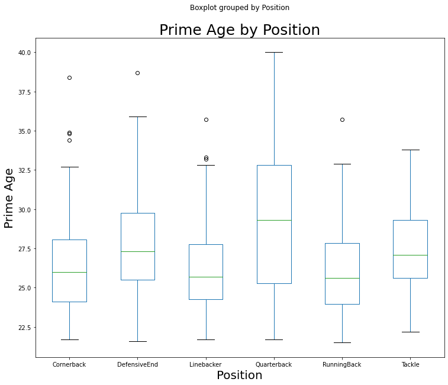

# NFL Player Analysis
Author: Daniel Sontag

## INTRODUCTION

With the recent advancement of data availability, over the past decade there has been a major uptick in synergy between analytics and sports. It has become big business with many companies capitalizing on the power that data can bring to an organization. Pro Football Focus (www.pff.com) has become a staple in the NFL analytics community proudly stating that in 2019 it was utilized by all 32 NFL teams. I will apply Pro Football Focus data from the last 10 years to predict the age of maximum performance across six vastly different positions in the NFL - Quarterback, Running Back, Tackle, Cornerback, Linebacker and Defensive End. In a salary capped league, determining the future value of players during contract negotiations is crucial in building a top caliber team. Additionally, I will be looking at alma mater of top tiered players to see if certain universities are producing NFL caliber players at a higher rate. Lastly, I'll look at height and weight of the players to determine if these quantifiable figures are a key indicator of success during the draft process.

## Cloning Repo and Installing Relevant Packages
1. Confirm that a version of Python 3 has been installed on your local machine
3. Open Git Bash and navigate to where you would like to clone my Repository using the CD "desired path" command
4. Run git clone "git@github.com:dannysontag1/NFL_Player_Analysis.git" or you can grab the key directly from my repo
5. Bring up the command prompt and once again nagivate to the cloned Repository using the CD "desired path" command
6. To make sure you have all the necessary packages to run my program, run "pip install -r requirements.txt" 

## Running my Project From Jupyter Notebook - Preferred
1. Bring up the command prompt and once again nagivate to the cloned Repository using the CD "desired path" command
2. From the command prompt run "jupyter notebook" and this should launch a browser window with all my cloned repo files
3. Open "NFL_Player_Analysis.ipynb" and run the program

## Running my Project From Any IDE
1. Launch your preferred IDE
2. Nagivate to the clone repo folder
3. Run "NFL_Player_Analysis.py"

## Requirements Met
My project has met the following requires outlined by Code Kentucky:
1. Read in data from a local csv, excel file, json, or any other file type. There are many ways to do this, but using Pandas read_ functions.
2. Use built-in pandas or numpy functions to do things like remove 0’s and null values where they don’t belong in your dataset. 
3. Use at least 5 different built-in Python functions to find out something about your data.
4. Make 2 basic plots with matplotlib, seaborn, or any other kind of visualization library that you think looks interesting.
5. Write markdown cells in Jupyter explaining your thought process and code. If you make a few plots with matplotlib, explain what the reader is seeing and why you chose to plot things that way

## Data Analysis Conclusions
### Age for Maximum Performance by Position
It appears there is a large correlation between the three skills positions of Running Back, Cornerback and Linebacker. These positions have a much larger emphasis on speed. Alternatively, there appears to be a correlation between the positions of Tackle and Defensive End. While speed is significant at these positions, power and strength are arguably superior. No position appears to correlate with Quarterback with them hitting their prime performance much later into their career. The quarterback position has a larger mental learning curve and takes many years for them to acclimate from college to pro. Additionally, recent rules changes over the last decade have been implemented to protect the health of this vital position which could be extending their careers.

